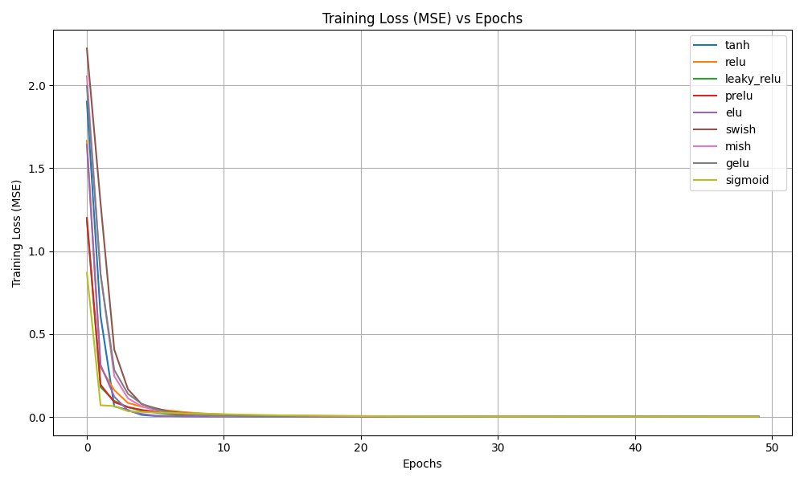
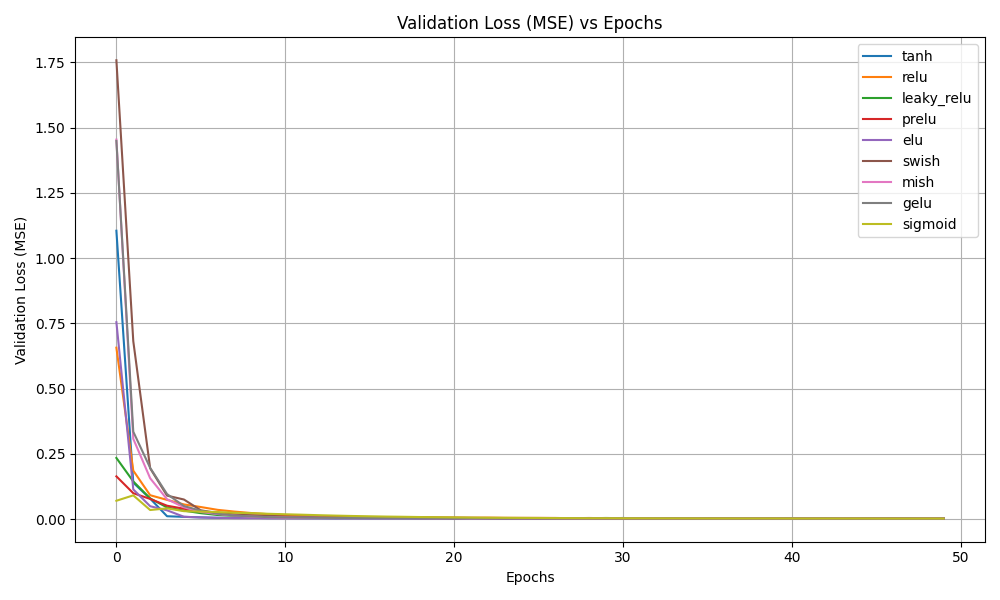
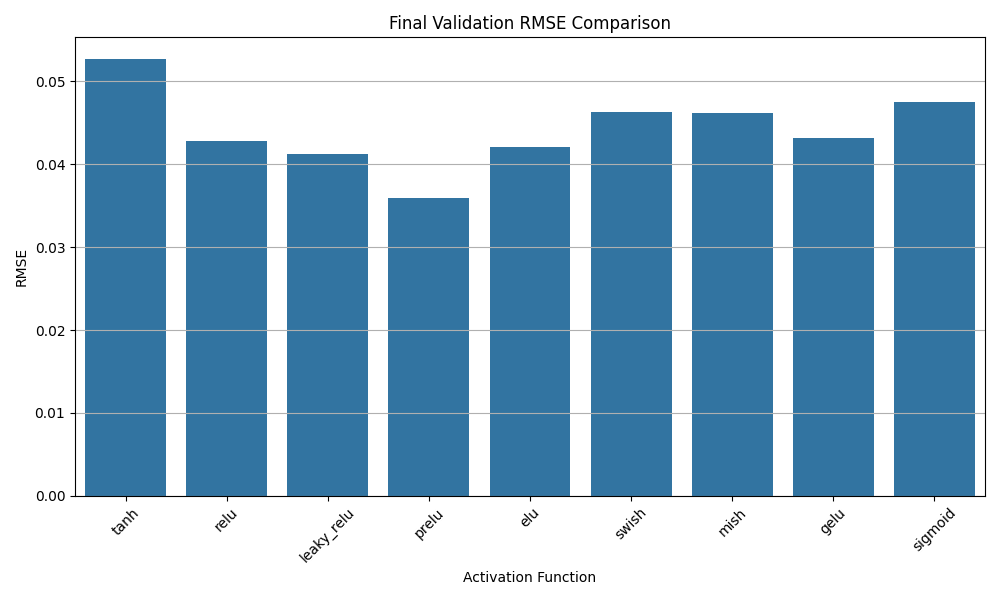

# 🔋 Battery State-of-Health (SoH) Prediction

## 📖 Overview
This project predicts the State-of-Health (SoH) of lithium-ion batteries using deep learning. It focuses on comparing different activation functions (ReLU, Sigmoid, Tanh) and analyzing their impact on model performance.

## 🎯 Objective
- Predict battery degradation over time  
- Compare activation functions  
- Evaluate model performance  

## 📂 Dataset
The dataset consists of battery charge-discharge cycle data including:
- Voltage  
- Current  
- Capacity  
- Cycle count  

These features are used to estimate battery health degradation.

## ⚙️ Methodology
1. Data preprocessing  
2. Feature extraction  
3. Model training using different activation functions  
4. Performance evaluation using:
   - MSE  
   - RMSE  

👉 Data-driven ML methods are widely used for accurate SoH prediction :contentReference[oaicite:1]{index=1}  

## 📊 Results

| Activation Function | Performance |
|--------------------|------------|
| ReLU              | Best convergence |
| Sigmoid           | Slower training |
| Tanh              | Moderate performance |

## 📸 Output

### Training Loss


### Validation Loss


### RMSE


## 🛠️ Tech Stack
- Python  
- TensorFlow / Keras  
- NumPy, Pandas  
- Matplotlib  

## ▶️ How to Run
```bash
pip install -r requirements.txt
python main.py
